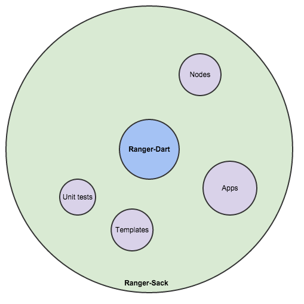

Ranger-Dart - v0.5.0 Beta
===========


##Contents:
- [About](#about-dart)
- [Screen shots](#shots)
- [Features](#features)
- [Getting started](#getting-started)
- [Libraries (Pubs)](#libraries)
- [Folder layout](#folders)
- [Documentation](#documentation)
- [Google Blog](#blog)
- [Author](#author)
- [License](#license)
- [RoadMap](#roadmap)
- [TODOs](#todos)
- [Further reading](#readings)
- [Showcases](#showcases)
- [Contributing](#contributing)

###[About](#about-dart)
**Ranger-Dart** (**Ranger** for short) is a game engine written in [Dart](https://www.dartlang.org/) and slightly modeled after an older version of [Cocos2d-js 1.x](http://www.cocos2d-x.org/products#cocos2dx-js). **Ranger** is actually two projects: this project and

##[Ranger-Sack (**Sack** for short)](https://github.com/wdevore/Ranger-Sack).



**Ranger** is the core piece needed to create games. The Sack isn't needed at all, it simply serves as a goto place for examples covering apps, templates and unit tests.

If you have ever worked with Cocos2D-js then you will recognize a fair amount of the examples. However, several things have changed, most notebly Animations and Messaging.

Initially **Ranger**'s code base was structured similar to Cocos2d. However, after using Dart design patterns and libraries (aka Pubs) the code base diverged and has changed considerably. The only *concepts* remaining are Scenes, Layers and Scheduler.

**Ranger** is a game engine currently centric around an HTML5-Canvas and a [Scene graph](http://en.wikipedia.org/wiki/Scene_graph). Rendering of the scene graph is rendered via a Context of type [CanvasRenderingContext2D](https://api.dartlang.org/apidocs/channels/stable/dartdoc-viewer/dart-dom-html.CanvasRenderingContext2D). In the future the [WebGLRenderingContext](https://developer.mozilla.org/en-US/docs/Web/API/WebGLRenderingContext) will be supported.

###[Screen shots](#shots)
**Ranger** in action via Sack: [ScreenShots and videos](docs/Screenshots.md)

###[Features](#features)
- Scene graph (heirarchical spatial organization) including space mappings.
- Animations using [Universal Tween Engine](https://pub.dartlang.org/packages/tweenengine) Pub by Xavier Guzman.
- Message system using [EventBus](https://pub.dartlang.org/packages/event_bus) Pub by Marco Jakob.
- Pooling ported from [Dartemis: Entity System Framework](https://pub.dartlang.org/packages/dartemis) Pub by Dennis Kaselow.
- Sprites and sprite sheets. (PNG, SVG etc...)
- Particle systems.
- Html5 Canvas rendering.
- Design resolution that is independent of device resolution.
- Scene transitions.
- Optional Updates-per-second for slower devices.
- Examples, starter templates and Unit tests.

> Note: if you are interested in an Entity System approach to game development consider Dartemis. It is based off the concept of Data Oriented Design (DOD). **Ranger** has the ability to add "systems" and feed timing to them so you can effectively code in a hybrid design where some of your code is hierarchical through a scene graph and other portions are more "linear-ish" through DOD. For further reference [Artemis](http://gamadu.com/artemis/).

###[Getting started](#getting-started)
Where to start? Easy, just follow these steps:

1. Download the [Dart SDK](https://www.dartlang.org/) and install it. If you are on a Mac then it is as easy as installing the .dmg.
2. Go to GitHub and download [Ranger-Sack](https://github.com/wdevore/Ranger-Sack). To do that choose to either *Clone in Desktop* or *Download ZIP*. If choose the Zip option then uncompress it to a location of your choosing. You should now have a folder called "Ranger-Sack".
3. Launch the [Dart Editor](https://www.dartlang.org/tools/editor/) that came with the SDK.
4. In the editor navigate to the file menu and choose *Open Existing Folder*.
 * Navigate to the location of either the uncompressed Zip or
 * The local Git repository that you cloned to your "desktop".
5. With the project open, run one of the *Templates* called "level0"
 * Navigate into the "level0" template folder located under:
```
web/
    applications/
        templates/
            level0
```
6. Right-click on **level0.html** and choose *Run in Dartium*.

Once [Dartium](https://www.dartlang.org/tools/dartium/) (which comes with the SDK) has launched it will automatically navigate to "http://localhost:8080/applications/templates/level0/level0.html" and start running. First you will see a splash scene for 3 seconds and then instaneously transition to a GameLayer with dark blue text displaying "*Ranger GameLayer*" on a dark grey background.

7. Congratulations. You have successfully installed and ran **Ranger**!


###[Libraries (Pubs)](#libraries)
**Ranger** relies on several Dart [Pubs](https://pub.dartlang.org/). 

- [EventBus](https://pub.dartlang.org/packages/event_bus) by Marco Jakob
- [Tween Engine](https://pub.dartlang.org/packages/tweenengine) by Xavier Guzman
- [Vector Math](https://pub.dartlang.org/packages/vector_math) by John McCutchan
- Browser. Every Dartium app relies on this Pub.

**Sack** relies on **Ranger** libraries plus several other Pubs

- color_slider_control
- gradient_colorstops_control
- lawndart.

###[Folder layout](#folders)
**Ranger** is a Pub and the core code is located under the *lib* folder. Here is a brief overview:
```
lib/
    ranger/
        animation/      -- Tween animation wrapper/helper
        core/           -- Pooling and timing (aka the Scheduler)
        geometry/       -- (Optional) Basic geometric shapes
        mixins/         -- Color, Input behaviors
        nodes/          -- The main visuals (Scenes, Layers etc...)
        particles/      -- (Optional) particle systems
        physics/        -- (Optional) Velocity
        rendering/      -- DrawContext (includes default implementations.)
        resources/      -- Imageloading and Embedded Base64 resources
        sprites/        -- Includes Canvas implementations
        utilities/      -- Misc
```
Basically there are 4 critical folders that matter when developing a game: *animation*, *core*, *mixins* and *nodes*. Other than that you are not required to use anything else. *geometry*, *particles*, *physics* and even *sprites* are not required.

The optional folders simply provide examples on how to build Nodes, and they are used mostly for the unit tests and templates.

###[Documentation](#documentation)
- [Getting started (Google doc)](https://docs.google.com/document/d/1k_vyVV9duqlMcCM4nZYc8B2BhyC_j4RXHg6WN6KSRPE/edit?usp=sharing)
- [Nodes (Google doc)](https://docs.google.com/document/d/1_uQJxKHuGpn82cWt3C2yBU-sfX2nb4BWKxhhJUpwKBA/edit?usp=sharing)
- [Animations (Google doc)](https://docs.google.com/document/d/1uFhSjwm1ehiZ3ni7yOUx5Cbf1LOVP9pcP3YcfumyFS4/edit?usp=sharing)
- [Scene Graph (Google doc)](https://docs.google.com/document/d/1CYAASqzukvdKToi7j9sv7TkiN4Le_ZjnFdN7I7uXqYI/edit?usp=sharing)
- [Development (--) -- NOT COMPLETE]()

These docs are not directly related to **Ranger**. But they could help your game development. They are all a work in progress.

- [Misc -- NOT COMPLETE]()
- [Physics -- NOT COMPLETE]()
- [Collision -- NOT COMPLETE]()


###[Google Blog](#blog)
**Ranger** has a [Blog](https://plus.google.com/u/0/b/109136453872758385259/109136453872758385259/posts) where I periodically post statues.

###[Author](#author)
Hello, I am [Will DeVore](https://plus.google.com/u/0/b/104513085420089025698/104513085420089025698/posts) the current developer of **Ranger** and **Sack**. I find it a pleasure working with the [Dart](https://www.dartlang.org/) language. Its integration with HTML/CSS/Canvas/WebGL is solid and functional.

###[License](#license)
See [MIT license](LICENSE)

###[TODOs](#todos)
**Ranger**'s code is still sprinkled with TODOs. Most are minor in nature. Some of the top areas are:
- Performance. Things like String conversions in places where code runs in tight loops.
- Pause/Resume. I need to add the pause/resume code when Scenes are transitioning. An early version was present but once I replaced the old dispatch code with Dart's Streams that code became obsolete.
- Visibility of browser/tabs. When a tab or the whole browser focus is lost the engine needs to recognize this and pause.
- Accelerometer code.
- Several pieces of code should be optimized to check for dirty flag on transformations. I have slacked off is a few areas--*in progress*.
- A better more full proof way of handling Infinite animations. At the moment the developer needs to track the Infinite animations. If they are not "killed" then cycles are wasted as the animation continues to animate objects that may be gone or invisible.

###[RoadMap](#roadmap)
There are still manys things that need to be done in **Ranger**. It will probably never really be complete, nonetheless, I have a list of things that I would like to add as time permits in no particular order.

- [WebGL](https://www.khronos.org/registry/webgl/specs/latest/). **Ranger** has preliminary polymophic support to accomodate WebGL. It is quite possible that an underlying library will be used; perhaps the [Three.dart Pub](https://pub.dartlang.org/packages/three) may be a viable candidate. Worst case is to follow something similar to Cocos2dx-3.x.
- Quad tree culling
- Physics with [Box2D Pub](https://pub.dartlang.org/packages/box2d)
- Fullscreen support
- Textures. Assuming WebGL is added.
- Additional transition effects.
- Add things to the [Ranger-Sack](https://github.com/wdevore/Ranger-Sack) GitHub repository. This repo will hold extensions to **Ranger**. For example, collision, zooming, zones, tracking, UI-kit etc.
- Components.

> Note: The idea was brought up about UX design. **Ranger** doesn't enforce any particular approach, but at the same time it would be convenient to have a sample UI-kit that may provide a launching point for coding GUIs in their games.
**Ranger**'s Unit tests and Applications (RangerParticles, RangerRocket) use a hybrid approach at the moment. Some icons (of SVG type) use hit testing while pop out panels use HTML. **Ranger**'s goal isn't to be an enforcer but enabler. Every game developer has an idea of what their UX should be and so there is no way a game engine could meet those expectations. Nonetheless, a sample UI-kit would provide ideas on howto wire things up and what options are possible.


###[Further reading](#readings)
- [Dart language](https://www.dartlang.org/)
- [WebGL](https://www.khronos.org/webgl/)
- [Html Canvas](https://developer.mozilla.org/en-US/docs/Web/Guide/HTML/Canvas_tutorial)
- [Core Html5 Canvas](http://www.amazon.com/Core-HTML5-Canvas-Animation-Development/dp/0132761610/ref=sr_1_2?ie=UTF8&qid=1411696766&sr=8-2&keywords=html5+canvas)
- [Cocos2D 3.0](http://www.amazon.com/Learning-iPhone-Game-Development-Cocos2D-ebook/dp/B00LB6DJ0U/ref=sr_1_1?ie=UTF8&qid=1411696840&sr=8-1&keywords=cocos2d)
- [Learning Cocos2D](http://www.amazon.com/Learning-Cocos2D-Hands--Building-Chipmunk-ebook/dp/B005BOMFIU/ref=sr_1_4?ie=UTF8&qid=1411696840&sr=8-4&keywords=cocos2d)

###[Showcases](#showcases)
None at the moment.

###[Contributing](#contributing)
There is still a fair amount of stuff to do to make **Ranger** feature complete. Contributing to **Ranger** would be helpful as the spirit of **Ranger** is maintained.

End.